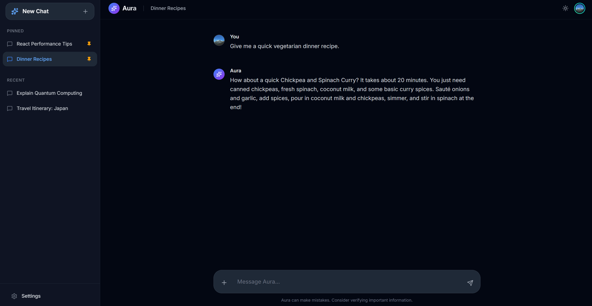

# Aura Chat — AI Chat UI Template

> A production-ready frontend template for building AI chat interfaces.  
> Bring your own backend. Ship in days, not weeks.

---

## Why This Exists

Every AI product eventually needs a chat interface. Most teams build the same thing — a message list, a text input, a sidebar, a theme toggle — over and over again, from scratch, burning time on UI plumbing instead of what actually differentiates their product.

**Aura is the starting point you wish you had.**

It's a fully-featured, visually polished chat UI built with the modern React stack. It handles the interface layer completely. You wire up your API, and you're live.


---

## What's Included

### Interface
- Multi-session chat management with pinned and recent conversations
- Full-screen welcome view with suggested prompts
- Auto-scrolling message thread
- Resizable, auto-expanding text input
- Settings modal with Account, Appearance, and Privacy tabs

### Experience

- Keyboard shortcuts (Cmd+K for search, Cmd+/ for help)
- Smooth message animations and real-time typing indicators
- Light / Dark mode with smooth transitions
- Responsive layout — sidebar adapts from desktop drawer to mobile overlay
- Subtle animations (fade-in-up on messages, pulse on icons)
- Custom scrollbar styling, no visible overflow artifacts
- Inter font, gradient accents, glassmorphism sidebar

### Pre-built Setting


### Engineering
- **React 18 + TypeScript** — strict mode, typed throughout
- **Tailwind CSS v4** — PostCSS pipeline, zero unused styles in production
- **Custom hooks** — `useTheme`, `useChats`, `useUIState` ready to extend
- **React Context** — clean action propagation, no prop drilling
- **ESLint + Prettier** — enforced code style out of the box
- **Vite** — instant HMR, fast production builds

---

## Backend Agnostic by Design

Aura has no opinion about your backend. There is no API call baked in — just a `getMockAiResponse()` function in `services/mockAiService.ts` that you replace with your own.

```ts
// services/mockAiService.ts  →  replace with your integration

export function getMockAiResponse(): Promise<string> {
  // OpenAI, Anthropic, Azure, Ollama, your own API — anything goes
  return openai.chat.completions.create({ ... });
}
```

Works with any AI provider:

| Provider | Integration |
|---|---|
| OpenAI / GPT-4 | `openai` SDK |
| Anthropic / Claude | `@anthropic-ai/sdk` |
| Google Gemini | `@google/generative-ai` |
| Azure OpenAI | `openai` SDK (Azure endpoint) |
| Ollama (local) | `fetch` to `localhost:11434` |
| Your own API | Any `fetch` / `axios` call |

Streaming, tool calling, function execution — none of that requires touching the UI layer. Drop it into the service, and messages flow.

---

## Get Started

```bash
git clone https://github.com/your-org/aura-chat-template
cd aura-chat-template
npm install
npm run dev
```

Open `http://localhost:5173`. You're looking at your new chat interface.

---

## Project Structure

```
aura-chat-template/
├── components/         # UI components (Sidebar, ChatArea, MessageBubble, ...)
├── context/            # ChatActionsContext — shared action dispatch
├── hooks/              # useTheme, useChats, useUIState
├── services/           # mockAiService.ts  ← replace this
├── types.ts            # Message, ChatSession, Theme
├── constants.ts        # Mock chats, suggested prompts
└── App.tsx             # Root — composes everything, no logic
```

---

## Stack

| Tool | Version | Role |
|---|---|---|
| React | 18 | UI framework |
| TypeScript | 5 | Type safety |
| Vite | 6 | Build tool |
| Tailwind CSS | 4 | Styling |
| lucide-react | latest | Icons |

---

## Roadmap

See [roadmap.md](./roadmap.md) for planned features: message actions, typing indicators, Markdown rendering, localStorage persistence, Cmd+K search, and more.

---

## License

MIT — use it, modify it, ship it.
